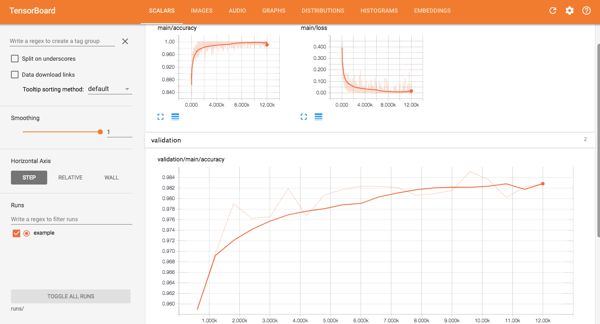

# Chainer-TensorBoard

This repository shows how to use TensorBoard from Chainer with MNIST example. 

[tensorboard-pytorch (tensorboardX)](https://github.com/lanpa/tensorboard-pytorch), a TensorBoard extension for Pytorch, is used for this.

## Usage

```bash
pip install -r requirements.txt
python main.py # start streaming data to the TensorBoard while training the model
```

```bash
# In another terminal, 
tensorboard --logdir runs

# Then open localhost:6006 in your browser, and you will see something like the screenshots below.
```

## Screenshots

### Loss and accuracy



### Model architecture

*Comming soon..*

### Model parameters

*Comming soon..*

## License

[MIT License](LICENSE.txt)
